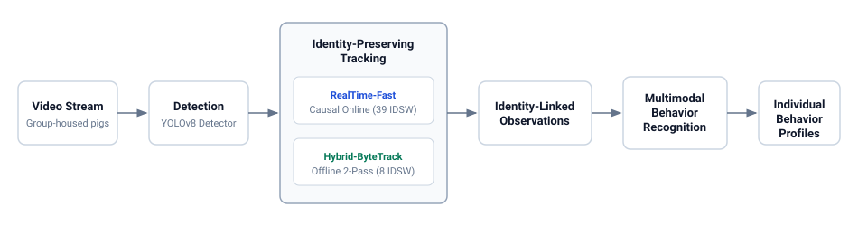
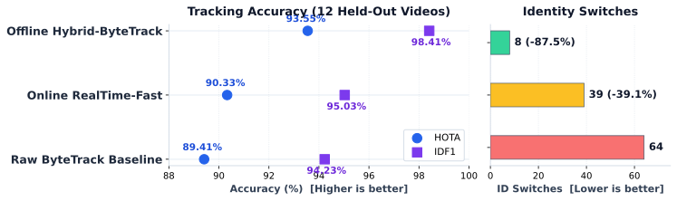
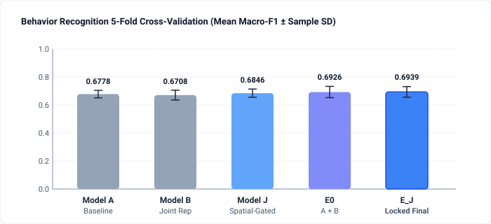
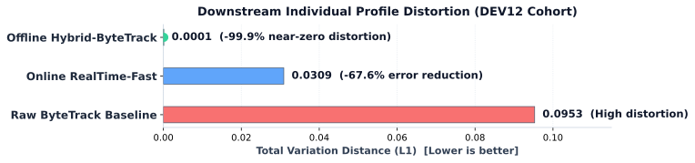

# Identity-Preserving Tracking and Multimodal Pig Behavior Recognition

> An end-to-end computer-vision pipeline for preserving individual identity and recognizing behavior over time in group-housed pigs.

[](https://github.com/tuanhmhe186947/q7m4x9v2k8n5r3t6p1/actions/workflows/ci.yml)
[](https://www.python.org/)
[](LICENSE)



---

## Highlights

| Component | Baseline | Proposed Causal | Proposed Retrospective | Key Metric Target |
| :--- | :--- | :--- | :--- | :--- |
| **Tracking Evaluation**<br>(12 held-out videos) | **Raw ByteTrack**<br>HOTA: 89.41%<br>IDF1: 94.23%<br>IDSW: 64 | **RealTime-Fast**<br>HOTA: 90.33%<br>IDF1: 95.03%<br>IDSW: 39 (-39.1%) | **Hybrid-ByteTrack**<br>HOTA: **93.55%**<br>IDF1: **98.41%**<br>IDSW: **8** (-87.5%) | Identity switch reduction from 64 to 8 switches |
| **Behavior Recognition**<br>(Group-aware 5-fold CV) | **Model A**: 0.677789 ± 0.026822<br>**Model B**: 0.670838 ± 0.034919 | — | **Model J**: 0.684646 ± 0.029199<br>**E0**: 0.692609 ± 0.040212<br>**E_J_FIXED50**: **0.693905 ± 0.037650** | Sample SD across five held-out video folds |
| **Downstream Profile Distortion**<br>(A1 Total Variation distance) | **Raw ByteTrack**<br>TV = 0.0953 | **RealTime-Fast**<br>TV = 0.0309 | **Hybrid-ByteTrack**<br>TV = **0.0001** | Measured on 12-video behavior-overlap subset |

---

## System Overview

Continuous precision livestock monitoring requires observing animals over extended periods without confusing individual subjects. This repository implements an integrated two-stage framework:
1. **Identity-Preserving Multi-Object Tracking**: Detects individuals via YOLOv8 and preserves identities across dense interactions using causal online association (`RealTime-Fast`) or retrospective two-pass smoothing (`Hybrid-ByteTrack`).
2. **Multimodal Spatio-Temporal Behavior Recognition**: Classifies individual time units into 10 behavior classes by integrating bounding-box motion dynamics, local spatial attention, and social context.
3. **Downstream Longitudinal Profiling**: Demonstrates how tracking identity errors distort downstream individual time budgets and proves that minimizing ID switches preserves longitudinal behavior statistics.

---

## Tracking Results

Tracking performance was evaluated on a held-out confirmatory cohort of 12 videos (21,600 frames, 96 individual pig trajectories) under `TRACKING_EVALUATOR_STANDARD_V2`. System-level baseline comparisons show substantial reduction in identity switches without compromising detection accuracy.



- Full evaluation metrics and 95% bootstrap confidence intervals are available in [docs/paper/tables/tracking_confirmatory.md](docs/paper/tables/tracking_confirmatory.md).

---

## Behavior Recognition

Behavior recognition evaluates 10 mutually exclusive behavioral categories using video-isolated 5-fold cross-validation (VG1–VG5) to prevent video leakage across train and validation splits. No separate distinct outer cohort was materialized.



- **Model A**: High-ceiling spatiotemporal baseline (Macro-F1: `0.677789 ± 0.026822`).
- **Model B**: Joint relational representation (Macro-F1: `0.670838 ± 0.034919`).
- **Model J**: Multimodal pre-GAP spatial attention with class-aware gating (`0.684646 ± 0.029199`).
- **E_J_FIXED50**: Locked final ensemble combining Model J with Model B logits (`0.693905 ± 0.037650`).
- Detailed fold-by-fold results and statistical conventions are documented in [docs/paper/tables/behavior_cv.md](docs/paper/tables/behavior_cv.md).

---

## Identity Preservation and Profile Distortion

Tracking errors directly degrade longitudinal behavioral monitoring: when two animals swap identities, their accumulated activity budgets cross-contaminate. Using the 12-video development behavior-overlap subset (DEV12), we quantify profile distortion using the Total Variation ($L_1$) distance across fixed human annotations.



- **Raw ByteTrack**: Produces high profile distortion ($\text{TV} = 0.0953$).
- **RealTime-Fast**: Reduces distortion by 67.6% ($\text{TV} = 0.0309$) in online causal streaming.
- **Hybrid-ByteTrack**: Reduces distortion by 99.9% ($\text{TV} = 0.0001$), establishing near-lossless longitudinal profile propagation.
- Dataset cohort definitions are detailed in [docs/paper/tables/dataset_roles.md](docs/paper/tables/dataset_roles.md).

---

## Repository Structure

```text
.
├── configs/            # Parameter configurations (configs/release/config_manifest.md)
├── data/               # Manifests, splits, and sample video sequences
├── docs/               # Technical guides, paper tables, and reproduction docs
│   ├── assets/         # Vector diagrams and benchmark plots
│   ├── paper/tables/   # Authoritative paper result tables
│   ├── api.md          # REST API reference documentation
│   ├── reproduction.md # Scientific claim and experiment reproduction guide
│   └── usage.md        # Command-line interface and profile usage
├── models/             # Detector and behavior classification model weights
├── scripts/            # CLI runners, evaluation tools, and paper checks
├── src/pig_behavior/   # Core library (tracking, behavior models, API)
└── tests/              # Bounded public unit and contract test suite
```

---

## Quick Start

### Installation

```bash
# Clone the repository
git clone https://github.com/tuanhmhe186947/q7m4x9v2k8n5r3t6p1.git
cd q7m4x9v2k8n5r3t6p1

# Create virtual environment and install lightweight tooling
python -m venv .venv
source .venv/bin/activate  # On Windows: .venv\Scripts\activate
pip install -e .
```

### Run Tracking

```bash
# Execute Hybrid-ByteTrack on a sample video
python scripts/run_tracking_mode.py --mode hybrid_bytetrack --video data/videos/sample.mp4

# Run causal real-time online tracking
python scripts/run_tracking_mode.py --mode realtime_fast --video data/videos/sample.mp4
```

For advanced CLI options, batch tracking, and parameter search, consult the [Usage Guide](docs/usage.md).

---

## Reproducing the Paper

To verify quantitative metric tokens against the frozen evidence ledger:

```bash
python scripts/paper/check_claim_numbers.py
```

Expected output: `PASS: 100% of metric tokens in manuscript narratives match the master evidence ledger.`

Complete reproduction instructions for tracking, cross-validation, and profile distortion experiments are provided in the [Reproduction Guide](docs/reproduction.md).

---

## Data and Model Availability

- **Model Weights**: Detection and spatiotemporal behavior model weights are structured in `models/`.
- **Dataset Manifests**: Cohort splits, unit manifests, and annotation specifications are located under `data/` and documented in [docs/paper/tables/dataset_roles.md](docs/paper/tables/dataset_roles.md).
- **FastAPI Service**: An interactive inference server is documented in [docs/api.md](docs/api.md).

---

## Citation

```bibtex
@article{pig_behavior_2026,
  title={Identity-Preserving Tracking and Multimodal Pig Behavior Recognition},
  author={Tuan, H. M.},
  year={2026},
  url={https://github.com/tuanhmhe186947/q7m4x9v2k8n5r3t6p1}
}
```

---

## License

This project is licensed under the MIT License - see the [LICENSE](LICENSE) file for details.
