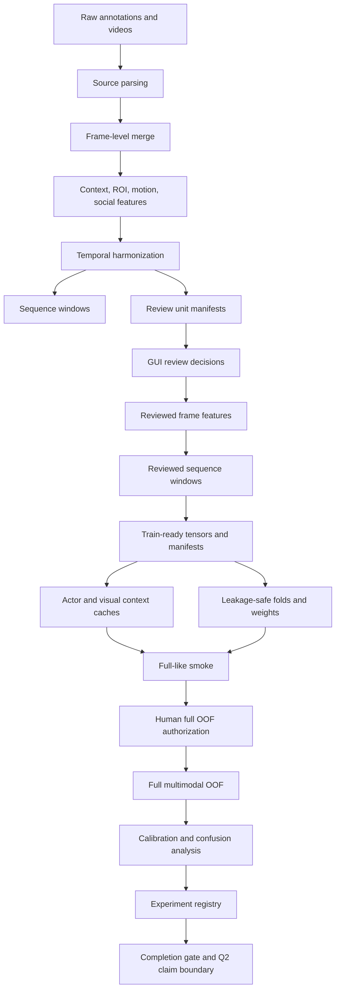

# classification_v2 Q2 Multimodal Workflow Map

This document is the operator map for the current Q2 multimodal
`classification_v2` workflow. It does not replace the deeper research protocol
or full OOF runbook. It exists to make the pipeline navigable before running a
long full OOF job.

Current policy:

- The full-like smoke and first full OOF run have completed, so the script
  organization layer has moved from plan to implementation.
- All operator scripts live under `scripts/classification_v2/<block>/`.
- The former `behavior_review_tools` and `dev_tools` wrappers are removed.
- Checkers are colocated with the stage whose contract they validate.

Related documents:

- [Q2 execution plan](CLASSIFICATION_V2_Q2_EXECUTION_PLAN.md)
- [Image/spatiotemporal roadmap](CLASSIFICATION_V2_SPATIOTEMPORAL_IMAGE_TRAINING_ROADMAP.md)
- [Full OOF runbook](classification_v2_q2_full_oof_runbook.md)
- [Research protocol](CLASSIFICATION_V2_Q1_Q2_RESEARCH_PROTOCOL.md)

## Status Snapshot

The full OOF run has completed. Postrun gates remain the authority for whether
the result is a Q2 internal candidate. Use this command for the aggregate
completion state:

```bat
cd /d C:\Users\ironh\Downloads\PIG_Behavior_Project
set PYTHONPATH=%CD%\src
C:\Users\ironh\anaconda3\envs\pig_project\python.exe ^
  scripts\classification_v2\09_final_release_audit\ ^
  check_classification_v2_full_readiness_once.py
```

This aggregate checker must not replace the stage-local checks. A failed stage
must be repaired in its numbered folder, then all dependent later stages must
be rerun.

## End-To-End Blocks



## Block Index

| Block | Purpose | Main scripts | Main artifacts |
|---|---|---|---|
| Source merge | legacy/CVAT frame rows | merge sources | `frame_features/*` |
| Feature build | geometry, ROI, motion, social | build feature scripts | `spatiotemporal_*` |
| Temporal units | CVAT 6f and legacy 16f policy | temporal harmonization | intervals CSV |
| Review units | human-review rows/templates | build review units | `review_units/*` |
| GUI/apply | review and apply decisions | GUI plus apply script | reviewed frames |
| Windows | reviewed training windows | build sequence windows | reviewed windows |
| Train-ready | X/y/masks/weights/splits | export train-ready | `train_ready_windows/*` |
| Cache | letterbox actor/context caches | cache builders | image caches |
| Baselines | B0/B1/B2 and pilots | baseline runners | registry records |
| Full gate | preflight, auth, launch packet | full OOF checks | `model_design/*` |
| Full OOF | learned multimodal OOF run | full OOF runner | `model_full/*` |
| Postrun | calibration, confusion, registry | postrun scripts | postrun artifacts |

## Current Run Order

Use the numbered directories in order:

1. Build and audit source, feature, temporal, review, train-ready, and cache
   artifacts with blocks `00-03`.
2. Pass model contracts and a bounded full-like smoke in block `04`.
3. Run preflight, authorization, and launch-packet checks in block `05`.
4. Run and validate full OOF training in block `06`.
5. Run calibration, native-unit metrics, confusion analysis, and ablations in
   block `07`.
6. Register the experiment and refresh Q2/paper reports in block `08`.
7. Run aggregate completion gates and refresh project memory in block `09`.

Do not skip the full-like smoke. It is the cheap check for cache loading,
CUDA/AMP, output schemas, checkpoint/resume behavior, and postrun compatibility.

## Directory Strategy

The crowded script folders have been split by workflow block. The organized
namespace is:

```text
scripts/classification_v2/
  00_source_feature_temporal/
  01_review_units_gui/
  02_train_ready_exports/
  03_image_cache_context/
  04_baselines_smokes/
  05_preflight_authorization/
  06_full_oof_training/
  07_postrun_evaluation/
  08_publication_reporting/
  09_final_release_audit/
```

No wrapper policy:

- New commands must use the numbered namespace directly.
- A repository scan for either former script namespace must return zero active
  executable references.
- Run stage-local checks first and the block `09` aggregate gate last.

## No-Leakage Boundary

Model input X may include:

- actor image sequence
- visual context sequence
- whitelisted geometry, motion, ROI relation, social relation tensors
- masks and quality numerics that do not encode labels or review decisions

Model input X must not include:

- `manual_*`, `review_*`, `behavior_before_review`, `original_behavior`
- `review_unit_id`, `window_id`, `temporal_unit_key`, `frame_uid`
- source, video, dataset, pig, track, path, split, policy text columns
- behavior labels or target ROI columns derived from labels

## Full-Run Claim Boundary

Before completion gate:

- Allowed: engineering readiness, smoke evidence, pre-full status.
- Not allowed: Q2 model performance claim.

After full OOF plus postrun completion:

- Allowed only if gate passes: Q2 internal session/video-safe improvement.
- Still not allowed: external farm, camera, cohort, or unseen-animal claim.
