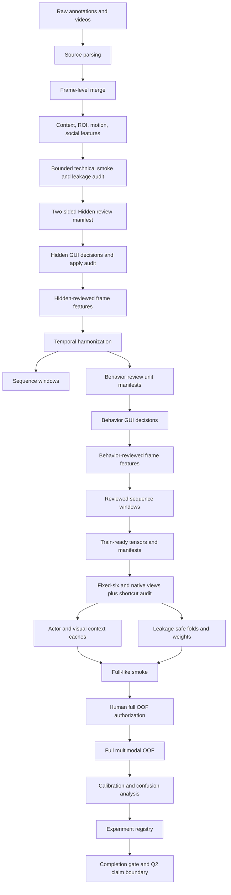

# classification_v2 Q2 Multimodal Workflow Map

This document is the operator map for the current Q2 multimodal
`classification_v2` workflow. It does not replace the deeper research protocol
or full OOF runbook. It exists to make the pipeline navigable before running a
long full OOF job.

Current policy:

- The first engineering full OOF completed for the previous artifact lineage.
  It is historical and does not bypass current human-review gates.
- The active lineage is at Hidden review in block `01`; status authority is
  `CLASSIFICATION_V2_CURRENT_STATE.md`.
- The bounded code/data-generation chain passes technical gate commit
  `1679aca`; this does not bypass either human-review layer.
- All operator scripts live under `scripts/classification_v2/<block>/`.
- The former split script namespaces and their wrappers are removed.
- Checkers are colocated with the stage whose contract they validate.
- Commit `bb225ff` adds fixture-verified fixed-six/phase/native temporal views
  and structural shortcut checks; active reviewed artifacts remain blocked.

Related documents:

- [Q2 execution plan](CLASSIFICATION_V2_Q2_EXECUTION_PLAN.md)
- [Image/spatiotemporal roadmap](CLASSIFICATION_V2_SPATIOTEMPORAL_IMAGE_TRAINING_ROADMAP.md)
- [Full OOF runbook](classification_v2_q2_full_oof_runbook.md)
- [Research protocol](CLASSIFICATION_V2_Q1_Q2_RESEARCH_PROTOCOL.md)

## Status Snapshot

The active reviewed-data lineage has not reached temporal harmonization or model
training. Complete the 5,171 Hidden v5 decisions, apply them, rebuild temporal
and behavior-review artifacts, then complete all 4,670 behavior decisions.

Technical evidence is separately PASS at
`outputs/classification_v2/rebuilds/scientific_smoke_identifier_v2_20260713`:
688 frame rows, 63 native/review units, 438 ordered windows, exact 110-feature
tabular X, zero trainable spatial gaps, and 8/8 deterministic reruns. Its
identifier-v2 and technical statuses are PASS with human review blocked.

The commit-`18d6692` full OOF and its block `09` aggregate report belong to the
previous lineage. Commit `bfdf913` found positional multimodal misalignment in
that run, so it is compute/debug evidence only and cannot support a performance
claim or authorize the active rebuild. Use
`CLASSIFICATION_V2_CURRENT_STATE.md` for the live PASS/FAIL matrix.

## End-To-End Blocks



## Block Index

| Block | Purpose | Main scripts | Main artifacts |
|---|---|---|---|
| Source merge | legacy/CVAT frame rows | merge sources | `frame_features/*` |
| Feature build | geometry, ROI, motion, social | build feature scripts | `spatiotemporal_*` |
| Technical smoke | count/X/repeatability audit | block `09` gate | audit JSON |
| Hidden review | policy-defined Yes/No cohorts | Hidden GUI/apply | reviewed frames |
| Temporal units | CVAT 6f and legacy 16f policy | temporal harmonization | intervals CSV |
| Review units | human-review rows/templates | build review units | `review_units/*` |
| GUI/apply | review and apply decisions | GUI plus apply script | reviewed frames |
| Windows | reviewed training windows | build sequence windows | reviewed windows |
| Train-ready | tensors, splits, temporal views | block `02` | `train_ready_windows/*` |
| Cache | letterbox actor/context caches | cache builders | image caches |
| Baselines | B0/B1/B2 and pilots | baseline runners | registry records |
| Full gate | preflight, auth, launch packet | full OOF checks | `model_design/*` |
| Full OOF | learned multimodal OOF run | full OOF runner | `model_full/*` |
| Postrun | calibration, confusion, registry | postrun scripts | postrun artifacts |

Hidden cohorts mean census of untrusted CVAT Yes, stratified audit of trusted
legacy Yes, and separate risk, random, and clean-control No cohorts.

## Current Run Order

Numbered folders describe code ownership. The data dependency order crosses
between blocks `00` and `01` and must be followed exactly:

1. Run block `00` source merge and frame-level feature construction.
2. Run block `01` Hidden template, media validation, human review, and apply.
3. Return to block `00` for temporal harmonization and sequence windows.
4. Run block `01` behavior-unit build, GUI review, coverage, and apply.
5. Run block `02` for reviewed exports, folds, fixed-six/native views, and
   shortcut audits; then block `03` for matching caches.
6. Pass block `04` contracts and bounded model smokes.
7. Run block `05` preflight and authorization bound to frozen hashes.
8. Run block `06` finalists, block `07` evaluation, block `08` reporting, and
   block `09` completion gates.

Before scaling step 1 to all source rows, run the bounded legacy+CVAT technical
chain and block `09` technical smoke gate. Every rerun that replaces an existing
derived artifact must declare `--overwrite`; changed semantics use a new
versioned root.

Do not skip the full-like smoke. It is the cheap check for cache loading,
CUDA/AMP, output schemas, checkpoint/resume behavior, and postrun compatibility.

## Directory Strategy

The crowded script folders have been split by workflow block. The organized
namespace is:

```text
scripts/classification_v2/
  00_source_feature_temporal/
  01_review_units_gui/
  02_train_ready_exports/
  03_image_cache_context/
  04_baselines_smokes/
  05_preflight_authorization/
  06_full_oof_training/
  07_postrun_evaluation/
  08_publication_reporting/
  09_final_release_audit/
```

No wrapper policy:

- New commands must use the numbered namespace directly.
- A repository scan for either former script namespace must return zero active
  executable references.
- Run stage-local checks first and the block `09` aggregate gate last.

## No-Leakage Boundary

Model input X may include:

- actor image sequence
- visual context sequence
- whitelisted geometry, motion, ROI relation, social relation tensors
- masks and quality numerics that do not encode labels or review decisions

Model input X must not include:

- `manual_*`, `review_*`, `behavior_before_review`, `original_behavior`
- `review_unit_id`, `window_id`, `temporal_unit_key`, `frame_uid`
- source, video, dataset, pig, track, path, split, policy text columns
- behavior labels or target ROI columns derived from labels

## Full-Run Claim Boundary

Before completion gate:

- Allowed only when proven for that same lineage: data readiness, smoke
  evidence, or pre-full engineering status.
- Current lineage may claim only audited template coverage and incomplete
  human-review status.
- Not allowed: Q2 model performance claim.

After full OOF plus postrun completion:

- Allowed only if gate passes: Q2 internal session/video-safe improvement.
- Still not allowed: external farm, camera, cohort, or unseen-animal claim.
