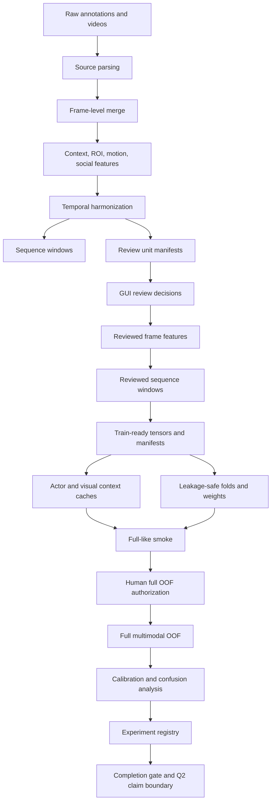

# classification_v2 Q2 Multimodal Workflow Map

This document is the operator map for the current Q2 multimodal
`classification_v2` workflow. It does not replace the deeper research protocol
or full OOF runbook. It exists to make the pipeline navigable before running a
long full OOF job.

Current policy:

- Do not move or rename existing scripts before the full-like smoke/full OOF
  path is stable.
- Use this document and the two script README files as the navigation layer.
- Keep canonical commands bound to existing paths until wrappers and packet
  writers are updated in small commits.
- Full OOF remains blocked until explicit human authorization is valid.

Related documents:

- [Q2 execution plan](CLASSIFICATION_V2_Q2_EXECUTION_PLAN.md)
- [Image/spatiotemporal roadmap](CLASSIFICATION_V2_SPATIOTEMPORAL_IMAGE_TRAINING_ROADMAP.md)
- [Full OOF runbook](classification_v2_q2_full_oof_runbook.md)
- [Research protocol](CLASSIFICATION_V2_Q1_Q2_RESEARCH_PROTOCOL.md)

## Status Snapshot

The current pre-full state is `PASS_PRE_FULL_READY_AUTHORIZATION_REQUIRED`.
Use one command as the authoritative pre-full summary:

```bat
cd /d C:\Users\ironh\Downloads\PIG_Behavior_Project
set PYTHONPATH=%CD%\src
C:\Users\ironh\anaconda3\envs\pig_project\python.exe ^
  scripts\dev_tools\check_classification_v2_full_readiness_once.py
```

Expected before authorization:

- `valid=true`
- `status=PASS_PRE_FULL_READY_AUTHORIZATION_REQUIRED`
- `errors=[]`
- `gate_count=44`
- `full_oof_execution_allowed=false`
- authorization blockers only

## End-To-End Blocks



## Block Index

| Block | Purpose | Main scripts | Main artifacts |
|---|---|---|---|
| Source merge | legacy/CVAT frame rows | merge sources | `frame_features/*` |
| Feature build | geometry, ROI, motion, social | build feature scripts | `spatiotemporal_*` |
| Temporal units | CVAT 6f and legacy 16f policy | temporal harmonization | intervals CSV |
| Review units | human-review rows/templates | build review units | `review_units/*` |
| GUI/apply | review and apply decisions | GUI plus apply script | reviewed frames |
| Windows | reviewed training windows | build sequence windows | reviewed windows |
| Train-ready | X/y/masks/weights/splits | export train-ready | `train_ready_windows/*` |
| Cache | letterbox actor/context caches | cache builders | image caches |
| Baselines | B0/B1/B2 and pilots | baseline runners | registry records |
| Full gate | preflight, auth, launch packet | full OOF checks | `model_design/*` |
| Full OOF | learned multimodal OOF run | full OOF runner | `model_full/*` |
| Postrun | calibration, confusion, registry | postrun scripts | postrun artifacts |

## Current Run Order

Use this order before the first long full OOF execution:

1. Maintain existing script paths.
2. Run the one-shot readiness audit.
3. Create human authorization only after reviewing the launch packet.
4. Run a short full-like smoke on the same full code path.
5. Validate smoke outputs and postrun readers.
6. Run full OOF once.
7. Run calibration, confusion comparison, registry, and completion gate.
8. Refresh memory only after full OOF and postrun gates finish.

Do not skip the full-like smoke. It is the cheap check for cache loading,
CUDA/AMP, output schemas, checkpoint/resume behavior, and postrun compatibility.

## Directory Strategy

The current script folders are crowded:

- `scripts/behavior_review_tools`
- `scripts/dev_tools`

Before full OOF, keep them stable. The safe organization layer is:

- this workflow map
- `scripts/behavior_review_tools/README.md`
- `scripts/dev_tools/README.md`

After full-like smoke passes, a future migration may add wrappers under:

```text
scripts/classification_v2/
  data_contract/
  review/
  cache/
  training/
  postrun/
  audits/
```

Migration rules:

- Move or rename only one block per commit.
- Keep compatibility wrappers at old paths until all launch packets and memory
  files are updated.
- Grep every old path before deleting a wrapper.
- Re-run `check_classification_v2_full_readiness_once.py` after each migration.

## No-Leakage Boundary

Model input X may include:

- actor image sequence
- visual context sequence
- whitelisted geometry, motion, ROI relation, social relation tensors
- masks and quality numerics that do not encode labels or review decisions

Model input X must not include:

- `manual_*`, `review_*`, `behavior_before_review`, `original_behavior`
- `review_unit_id`, `window_id`, `temporal_unit_key`, `frame_uid`
- source, video, dataset, pig, track, path, split, policy text columns
- behavior labels or target ROI columns derived from labels

## Full-Run Claim Boundary

Before completion gate:

- Allowed: engineering readiness, smoke evidence, pre-full status.
- Not allowed: Q2 model performance claim.

After full OOF plus postrun completion:

- Allowed only if gate passes: Q2 internal session/video-safe improvement.
- Still not allowed: external farm, camera, cohort, or unseen-animal claim.
